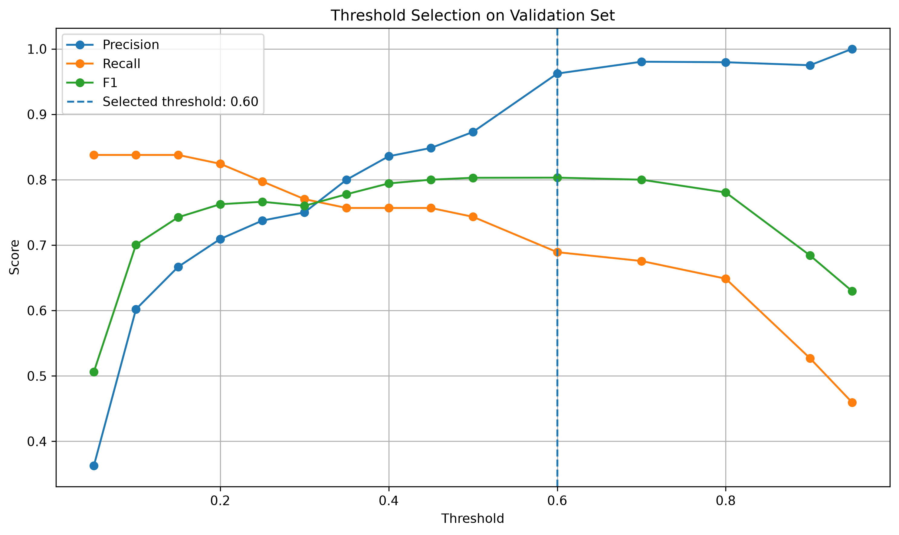

# Fraud Detection MLOps Pipeline

An end-to-end machine learning pipeline for detecting fraudulent credit card
transactions — from model training and experiment tracking to API serving and
containerization.

## Table of Contents
- [Dataset](#dataset)
- [Approach](#approach)
- [Results](#results)
- [Project Structure](#project-structure)
- [Setup and Usage](#setup-and-usage)
- [Docker](#docker)
- [MLOps Components](#mlops-components)
- [Limitations and Future Work](#limitations-and-future-work)

## Dataset

[Kaggle Credit Card Fraud Detection](https://www.kaggle.com/datasets/mlg-ulb/creditcardfraud)
dataset: 284,807 transactions, only 492 (0.17%) of which are fraudulent — a
severely imbalanced classification problem. Features consist of `Time`, `Amount`,
and PCA-transformed components `V1`-`V28` (transformed for confidentiality).

## Approach

### Data Splitting
The data was split into train (70%), validation (15%), and test (15%) sets
using stratified sampling, preserving the class imbalance ratio across all
three splits.

### Model Selection
Logistic Regression and Random Forest were compared. **PR-AUC** (Precision-Recall
AUC) was used as the selection criterion rather than ROC-AUC, since ROC-AUC can be
misleadingly optimistic on datasets with this level of class imbalance. This
comparison was done independently of any threshold choice.

### Threshold Selection
Once the better-performing model was identified, a threshold sweep was run on
the validation set, and the threshold that maximizes **F1 score** was selected.
F1 was chosen because no real business cost matrix (cost of a missed fraud vs.
cost of a false alarm) was available. A cost-based threshold could be adopted in
the future if such data becomes available.

## Results

Final model: **Random Forest**
Selected threshold: **0.60**

### Final Test Metrics

| Metric | Value |
|---|---:|
| Precision | 0.9655 |
| Recall | 0.7568 |
| F1 Score | 0.8485 |
| ROC-AUC | 0.9429 |
| PR-AUC | 0.8085 |

### Confusion Matrix

| Actual / Predicted | Predicted: Normal | Predicted: Fraud |
|---|---:|---:|
| Actual: Normal | 42,646 TN | 2 FP |
| Actual: Fraud | 18 FN | 56 TP |

### Threshold Selection on Validation Set



Precision and recall trade off as expected as the threshold changes. The
selected threshold was 0.60 because it achieved the highest validation F1 score.

## Project Structure

```text
fraud-detection-mlops/
├── .github/
│   └── workflows/
│       └── ci.yml
├── src/
│   ├── __init__.py
│   ├── api.py
│   ├── data_check.py
│   ├── preprocess.py
│   ├── train.py
│   ├── training_utils.py
│   └── visualization_utils.py
├── tests/
│   ├── test_api.py
│   ├── test_model.py
│   └── test_training_utils.py
├── models/
│   ├── fraud_model.pkl
│   └── model_info.json
├── reports/
│   └── figures/
│       └── threshold_metrics.png
├── Dockerfile
├── requirements.txt
├── requirements-dev.txt
└── README.md
```

## Setup and Usage

### Install dependencies

```bash
pip install -r requirements.txt
```

For development, training, and testing:

```bash
pip install -r requirements-dev.txt
```

### Add the dataset

Download the Kaggle dataset and place the CSV file under:

```text
data/creditcard.csv
```

### Train the model

```bash
python src/train.py
```

### Start the API

```bash
uvicorn src.api:app --reload
```

API documentation:

```text
http://localhost:8000/docs
```

Available endpoints:

| Method | Endpoint | Description |
|---|---|---|
| GET | `/health` | Checks whether the API is running |
| GET | `/model-info` | Returns model metadata |
| POST | `/predict` | Returns fraud probability and prediction |

---

### Run tests

```bash
pytest tests/ -v
```

## Docker

Build the image:

```bash
docker build -t fraud-api .
```

Run the container:

```bash
docker run -p 8000:8000 fraud-api
```

API documentation:

```text
http://localhost:8000/docs
```

---

## MLOps Components

- *Experiment Tracking:* MLflow was used to track model experiments, validation metrics, final test metrics, parameters, and model artifacts.
- *API Serving:* FastAPI was used to serve the trained model through /predict, /health, and /model-info endpoints.
- *Containerization:* Docker was used to package the API service into a reproducible container.
- *Model Metadata:* Final model information such as selected threshold, feature columns, and test metrics is stored in model_info.json.
- *Reproducible Training Pipeline:* The training process includes data splitting, model comparison, threshold selection, final evaluation, and model saving.
- *Continuous Integration:* GitHub Actions is used to automatically run tests and validate the Docker build on every push and pull request to the main branch.
---

## Limitations and Future Work

Several improvements could be added to extend this project further:

- *Cross-validation:* K-fold cross-validation could be added to make model comparison less sensitive to a single train/validation split.
- *Hyperparameter tuning:* Random Forest hyperparameters could be optimized using RandomizedSearchCV or GridSearchCV.
- *Resampling strategies:* SMOTE, undersampling, or hybrid resampling methods could be evaluated and compared against the current class_weight="balanced" approach.
- *Cost-based threshold selection:* If real business costs for false positives and false negatives become available, the threshold could be optimized using a cost-based objective instead of F1 score. A future version could assign different costs to FN and FP cases and choose the threshold that minimizes the total expected business cost.
- *Model monitoring:* Data drift and model performance monitoring could be added using tools such as Evidently AI.
- *Cloud deployment:* The Dockerized API could be deployed to a cloud platform.

